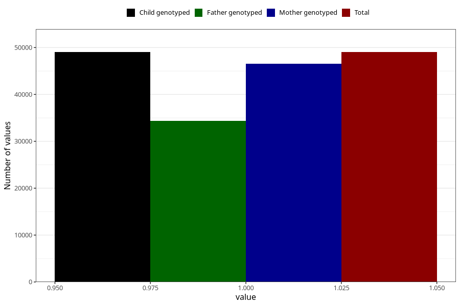

# hip_disorder_dislocated_hip_no_18m
Variable mapping to `EE787` in `Skjema5_18mnd_v12`.
- Number of values:

| Value | Total | Child genotyped | Mother genotyped | Father genotyped |
| ----- | ----- | --------------- | ---------------- | ---------------- |
| Missing | 26285 | 26285 | 25068 | 15733 |
| Non-missing | 49023 | 49023 | 46582 | 34351 |
| 1 | 49023 | 49023 | 46582 | 34351 |

