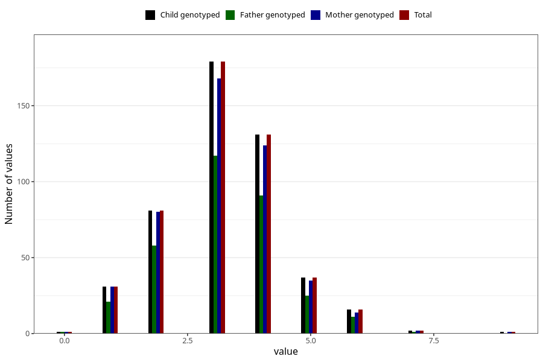

# hip_dysplasia_treatment_duration_6m
Variable mapping to `DD262` in `Skjema4_6mnd_v12`.
- Number of values:

| Value | Total | Child genotyped | Mother genotyped | Father genotyped |
| ----- | ----- | --------------- | ---------------- | ---------------- |
| Missing | 74829 | 74829 | 71194 | 49759 |
| Non-missing | 479 | 479 | 456 | 325 |
| 0 | 1 | 1 | 1 | 1 |
| 1 | 31 | 31 | 31 | 21 |
| 2 | 81 | 81 | 80 | 58 |
| 3 | 179 | 179 | 168 | 117 |
| 4 | 131 | 131 | 124 | 91 |
| 5 | 37 | 37 | 35 | 25 |
| 6 | 16 | 16 | 14 | 11 |
| 7 | 2 | 2 | 2 | 1 |
| 9 | 1 | 1 | 1 | 0 |

