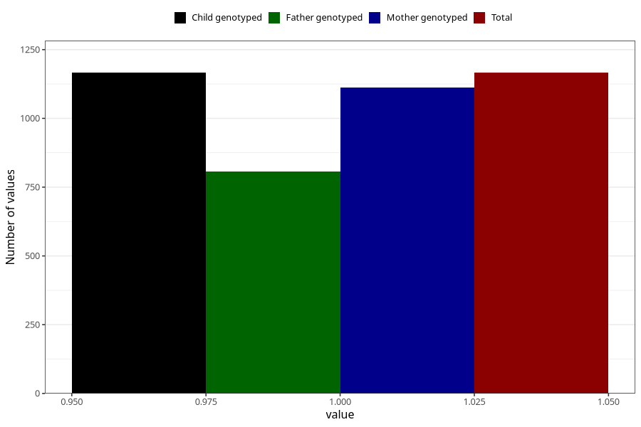

# hives_previously_18m
Variable mapping to `EE833` in `Skjema5_18mnd_v12`.
- Number of values:

| Value | Total | Child genotyped | Mother genotyped | Father genotyped |
| ----- | ----- | --------------- | ---------------- | ---------------- |
| Missing | 74142 | 74142 | 70537 | 49278 |
| Non-missing | 1166 | 1166 | 1113 | 806 |
| 1 | 1166 | 1166 | 1113 | 806 |

