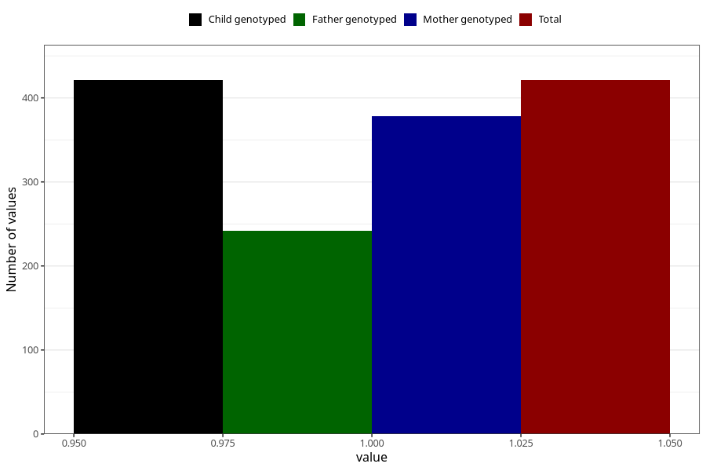

# hyperactivity_currently_8y
Variable mapping to `NN45` in `Skjema8aar_v12`.
- Number of values:

| Value | Total | Child genotyped | Mother genotyped | Father genotyped |
| ----- | ----- | --------------- | ---------------- | ---------------- |
| Missing | 74887 | 74887 | 71272 | 49842 |
| Non-missing | 421 | 421 | 378 | 242 |
| 1 | 421 | 421 | 378 | 242 |

