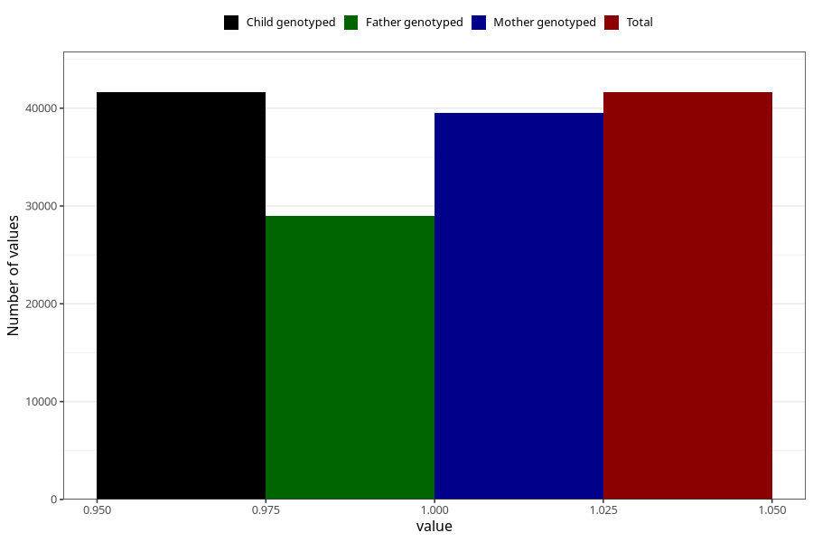

# hyperactivity_no_3y
Variable mapping to `GG105` in `Skjema6_3aar_v12`.
- Number of values:

| Value | Total | Child genotyped | Mother genotyped | Father genotyped |
| ----- | ----- | --------------- | ---------------- | ---------------- |
| Missing | 33686 | 33686 | 32102 | 21087 |
| Non-missing | 41622 | 41622 | 39548 | 28997 |
| 1 | 41622 | 41622 | 39548 | 28997 |

