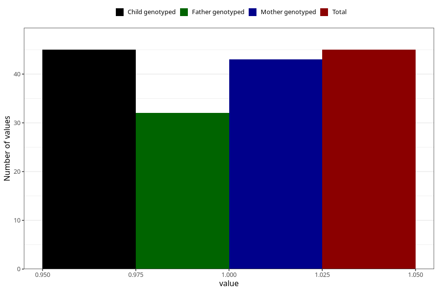

# other_behavioral_problems_previous_3y
Variable mapping to `GG111` in `Skjema6_3aar_v12`.
- Number of values:

| Value | Total | Child genotyped | Mother genotyped | Father genotyped |
| ----- | ----- | --------------- | ---------------- | ---------------- |
| Missing | 75263 | 75263 | 71607 | 50052 |
| Non-missing | 45 | 45 | 43 | 32 |
| 1 | 45 | 45 | 43 | 32 |

