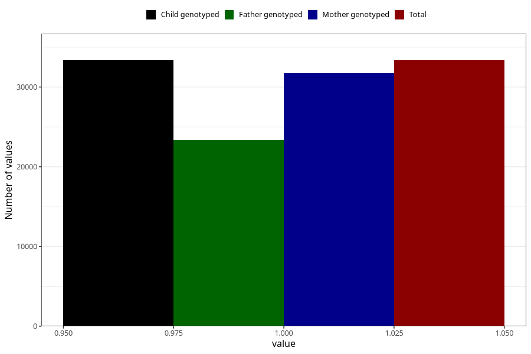

# other_malformations_no_18m
Variable mapping to `EE851` in `Skjema5_18mnd_v12`.
- Number of values:

| Value | Total | Child genotyped | Mother genotyped | Father genotyped |
| ----- | ----- | --------------- | ---------------- | ---------------- |
| Missing | 41952 | 41952 | 39934 | 26709 |
| Non-missing | 33356 | 33356 | 31716 | 23375 |
| 1 | 33356 | 33356 | 31716 | 23375 |

