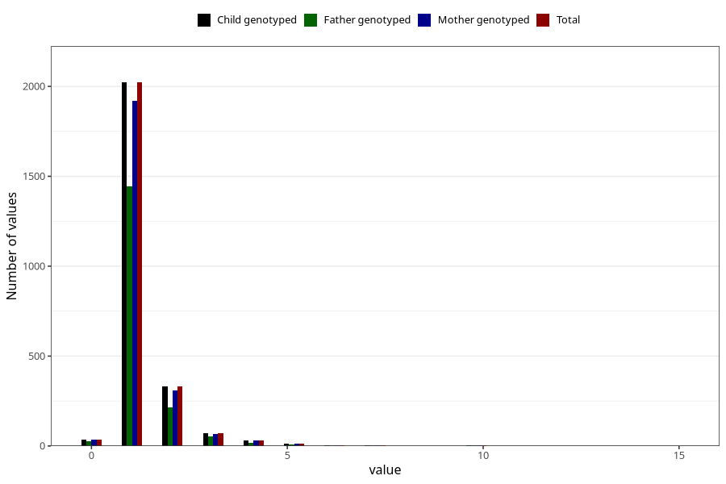

# pneumonia_freq_3y
Variable mapping to `GG147` in `Skjema6_3aar_v12`.
- Number of values:

| Value | Total | Child genotyped | Mother genotyped | Father genotyped |
| ----- | ----- | --------------- | ---------------- | ---------------- |
| Missing | 72786 | 72786 | 69259 | 48308 |
| Non-missing | 2522 | 2522 | 2391 | 1776 |
| 0 | 37 | 37 | 37 | 26 |
| 1 | 2022 | 2022 | 1918 | 1444 |
| 2 | 331 | 331 | 311 | 215 |
| 3 | 73 | 73 | 68 | 53 |
| 4 | 31 | 31 | 30 | 19 |
| 5 | 13 | 13 | 12 | 8 |
| 6 | 5 | 5 | 5 | 4 |
| 7 | 4 | 4 | 4 | 3 |
| 9 | 1 | 1 | 1 | 0 |
| 10 | 3 | 3 | 3 | 3 |
| 12 | 1 | 1 | 1 | 0 |
| 15 | 1 | 1 | 1 | 1 |

