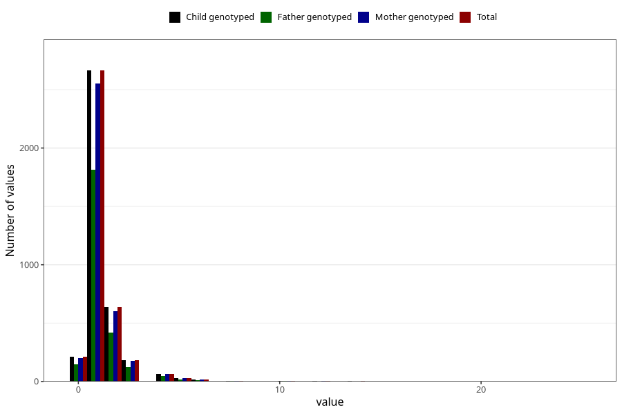

# pseudocroup_number_12_18m
Variable mapping to `EE233` in `Skjema5_18mnd_v12`.
- Number of values:

| Value | Total | Child genotyped | Mother genotyped | Father genotyped |
| ----- | ----- | --------------- | ---------------- | ---------------- |
| Missing | 71480 | 71480 | 67988 | 47491 |
| Non-missing | 3828 | 3828 | 3662 | 2593 |
| 0 | 211 | 211 | 198 | 147 |
| 1 | 2664 | 2664 | 2554 | 1812 |
| 2 | 636 | 636 | 605 | 416 |
| 3 | 181 | 181 | 175 | 123 |
| 4 | 67 | 67 | 65 | 49 |
| 5 | 28 | 28 | 27 | 16 |
| 6 | 16 | 16 | 16 | 12 |
| 7 | 1 | 1 | 1 | 0 |
| 8 | 5 | 5 | 4 | 5 |
| 10 | 3 | 3 | 3 | 3 |
| 11 | 1 | 1 | 1 | 1 |
| 12 | 4 | 4 | 3 | 2 |
| 13 | 1 | 1 | 1 | 0 |
| 14 | 3 | 3 | 2 | 2 |
| 15 | 1 | 1 | 1 | 1 |
| 16 | 1 | 1 | 1 | 1 |
| 17 | 2 | 2 | 2 | 1 |
| 18 | 2 | 2 | 2 | 2 |
| 25 | 1 | 1 | 1 | 0 |

