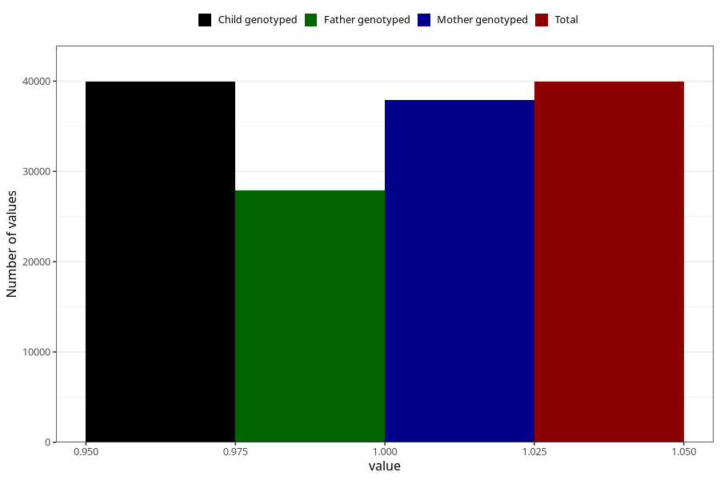

# sleep_problems_no_3y
Variable mapping to `GG97` in `Skjema6_3aar_v12`.
- Number of values:

| Value | Total | Child genotyped | Mother genotyped | Father genotyped |
| ----- | ----- | --------------- | ---------------- | ---------------- |
| Missing | 35377 | 35377 | 33706 | 22228 |
| Non-missing | 39931 | 39931 | 37944 | 27856 |
| 1 | 39931 | 39931 | 37944 | 27856 |

