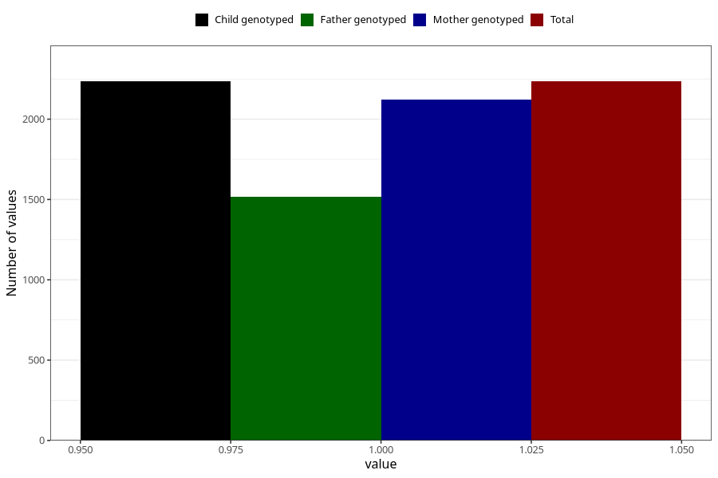

# sleep_problems_previously_18m
Variable mapping to `EE845` in `Skjema5_18mnd_v12`.
- Number of values:

| Value | Total | Child genotyped | Mother genotyped | Father genotyped |
| ----- | ----- | --------------- | ---------------- | ---------------- |
| Missing | 73073 | 73073 | 69530 | 48565 |
| Non-missing | 2235 | 2235 | 2120 | 1519 |
| 1 | 2235 | 2235 | 2120 | 1519 |

