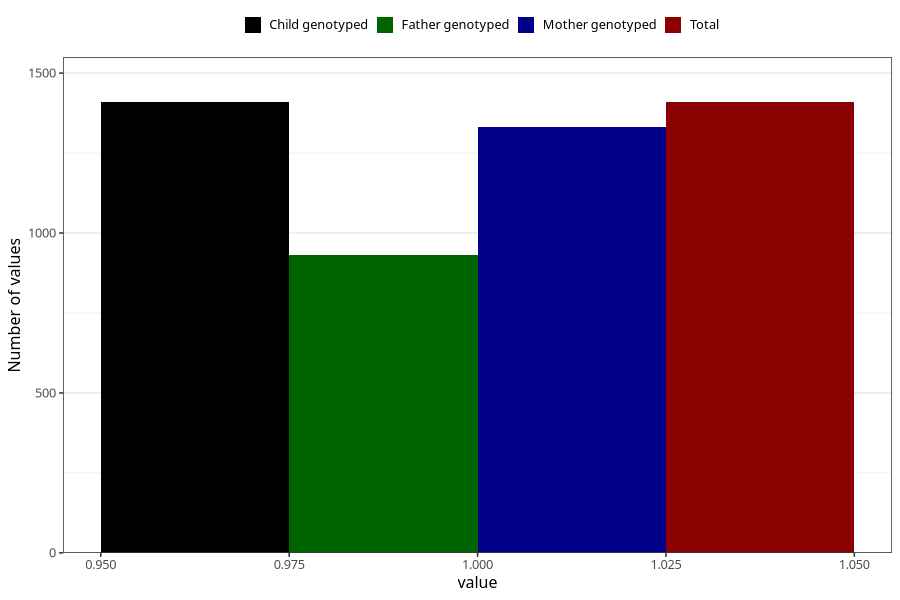

# sleep_problems_yes_18m
Variable mapping to `EE844` in `Skjema5_18mnd_v12`.
- Number of values:

| Value | Total | Child genotyped | Mother genotyped | Father genotyped |
| ----- | ----- | --------------- | ---------------- | ---------------- |
| Missing | 73899 | 73899 | 70319 | 49152 |
| Non-missing | 1409 | 1409 | 1331 | 932 |
| 1 | 1409 | 1409 | 1331 | 932 |

