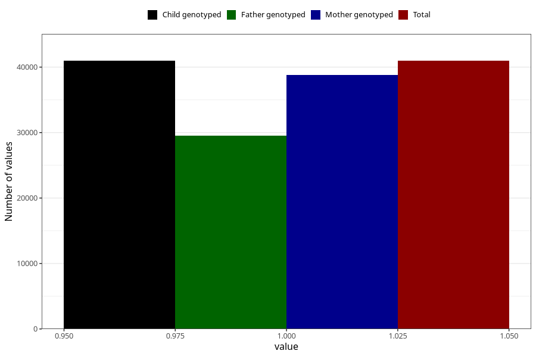

# social_problems_no_18m
Variable mapping to `EE967` in `Skjema5_18mnd_v12`.
- Number of values:

| Value | Total | Child genotyped | Mother genotyped | Father genotyped |
| ----- | ----- | --------------- | ---------------- | ---------------- |
| Missing | 34347 | 34347 | 32850 | 20599 |
| Non-missing | 40961 | 40961 | 38800 | 29485 |
| 1 | 40961 | 40961 | 38800 | 29485 |

