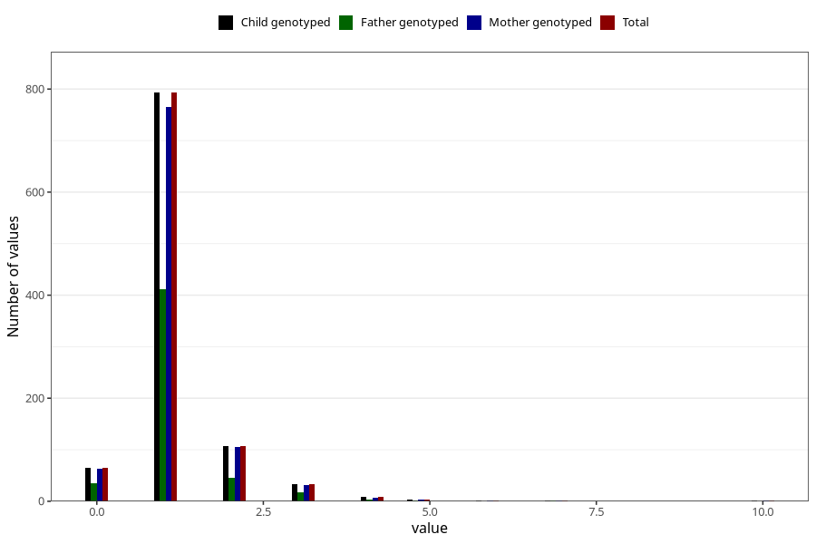

# throat_infection_number_6_11m
Variable mapping to `EE221` in `Skjema5_18mnd_v12`.
- Number of values:

| Value | Total | Child genotyped | Mother genotyped | Father genotyped |
| ----- | ----- | --------------- | ---------------- | ---------------- |
| Missing | 74295 | 74295 | 70670 | 49567 |
| Non-missing | 1013 | 1013 | 980 | 517 |
| 0 | 64 | 64 | 63 | 35 |
| 1 | 793 | 793 | 765 | 412 |
| 2 | 107 | 107 | 106 | 46 |
| 3 | 33 | 33 | 31 | 18 |
| 4 | 8 | 8 | 7 | 3 |
| 5 | 4 | 4 | 4 | 2 |
| 6 | 1 | 1 | 1 | 0 |
| 7 | 2 | 2 | 2 | 1 |
| 10 | 1 | 1 | 1 | 0 |

