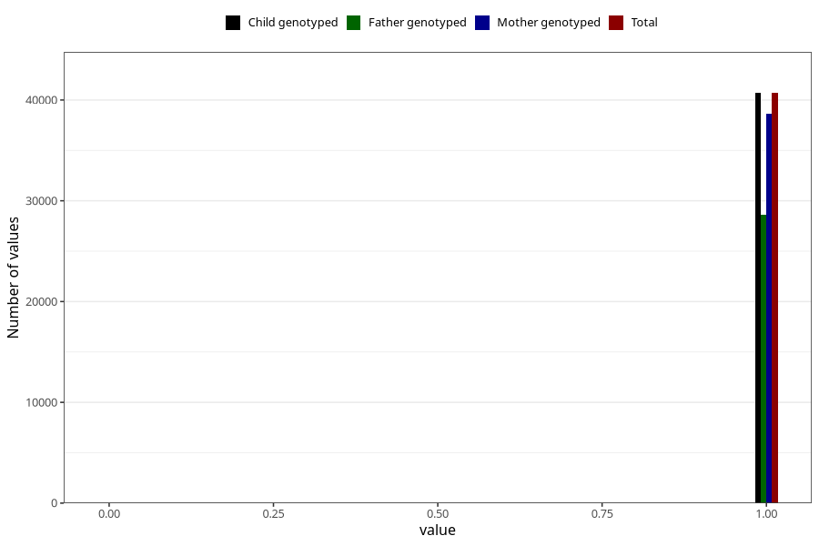

# trouble_relating_to_others_no_3y
Variable mapping to `GG578` in `Skjema6_3aar_v12`.
- Number of values:

| Value | Total | Child genotyped | Mother genotyped | Father genotyped |
| ----- | ----- | --------------- | ---------------- | ---------------- |
| Missing | 34596 | 34596 | 32988 | 21443 |
| Non-missing | 40712 | 40712 | 38662 | 28641 |
| 0 | 18 | 18 | 17 | 12 |
| 1 | 40694 | 40694 | 38645 | 28629 |

