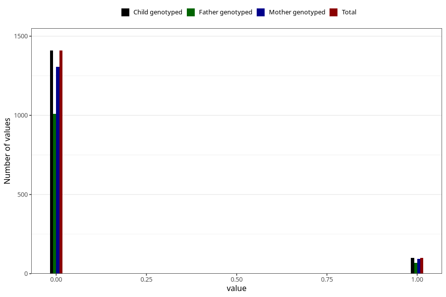

# trouble_relating_to_others_yes_3y
Variable mapping to `GG579` in `Skjema6_3aar_v12`.
- Number of values:

| Value | Total | Child genotyped | Mother genotyped | Father genotyped |
| ----- | ----- | --------------- | ---------------- | ---------------- |
| Missing | 73799 | 73799 | 70250 | 49008 |
| Non-missing | 1509 | 1509 | 1400 | 1076 |
| 0 | 1409 | 1409 | 1307 | 1009 |
| 1 | 100 | 100 | 93 | 67 |

