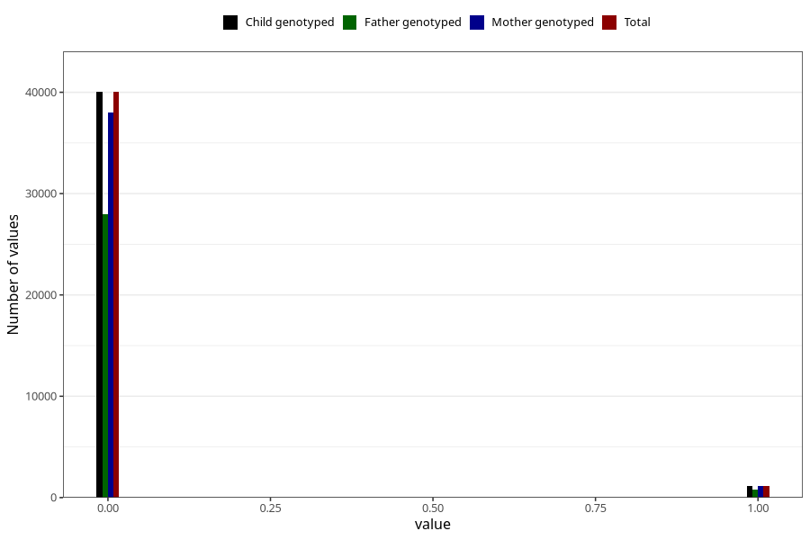

# underweight_3y
Variable created during phenotype curation.
- Number of values:

| Value | Total | Child genotyped | Mother genotyped | Father genotyped |
| ----- | ----- | --------------- | ---------------- | ---------------- |
| Missing | 34098 | 34098 | 32497 | 21365 |
| Non-missing | 41210 | 41210 | 39153 | 28719 |
| 0 | 40029 | 40029 | 38036 | 27928 |
| 1 | 1181 | 1181 | 1117 | 791 |

