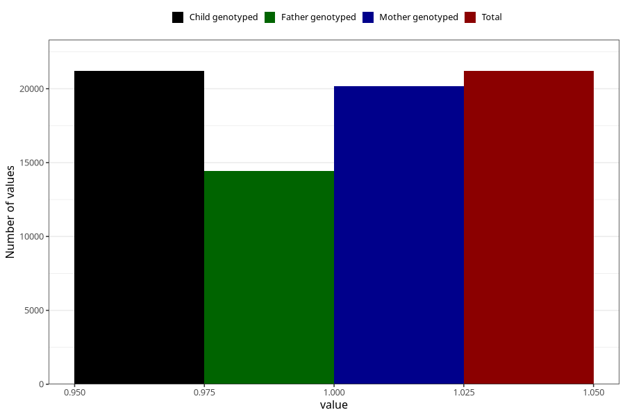

# breastmilk_12_14m
Variable mapping to `EE14` in `Skjema5_18mnd_v12`.
- Number of values:

| Value | Total | Child genotyped | Mother genotyped | Father genotyped |
| ----- | ----- | --------------- | ---------------- | ---------------- |
| Missing | 54111 | 54111 | 51485 | 35647 |
| Non-missing | 21197 | 21197 | 20165 | 14437 |
| 1 | 21197 | 21197 | 20165 | 14437 |

