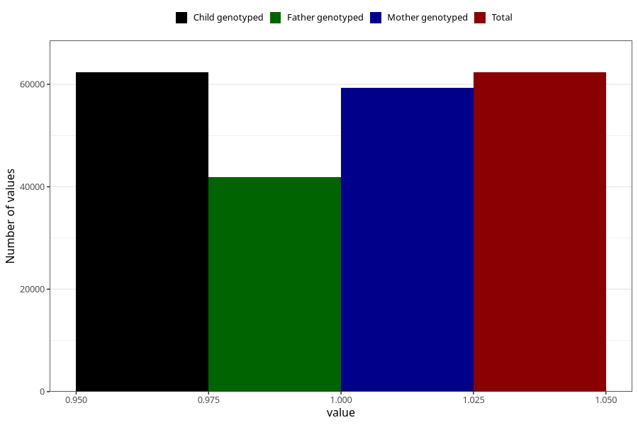

# breastmilk_1m
Variable mapping to `DD50` in `Skjema4_6mnd_v12`.
- Number of values:

| Value | Total | Child genotyped | Mother genotyped | Father genotyped |
| ----- | ----- | --------------- | ---------------- | ---------------- |
| Missing | 12978 | 12978 | 12300 | 8149 |
| Non-missing | 62330 | 62330 | 59350 | 41935 |
| 1 | 62330 | 62330 | 59350 | 41935 |

