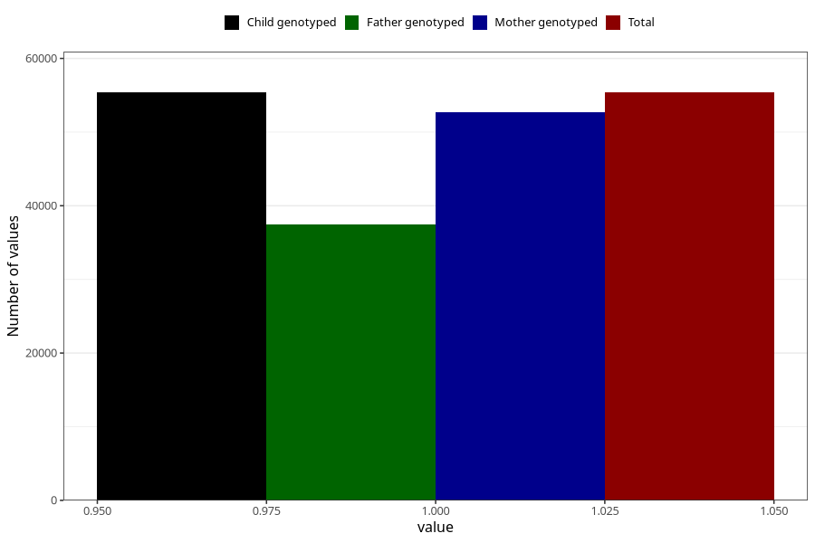

# breastmilk_5m
Variable mapping to `DD54` in `Skjema4_6mnd_v12`.
- Number of values:

| Value | Total | Child genotyped | Mother genotyped | Father genotyped |
| ----- | ----- | --------------- | ---------------- | ---------------- |
| Missing | 19931 | 19931 | 18910 | 12654 |
| Non-missing | 55377 | 55377 | 52740 | 37430 |
| 1 | 55377 | 55377 | 52740 | 37430 |

