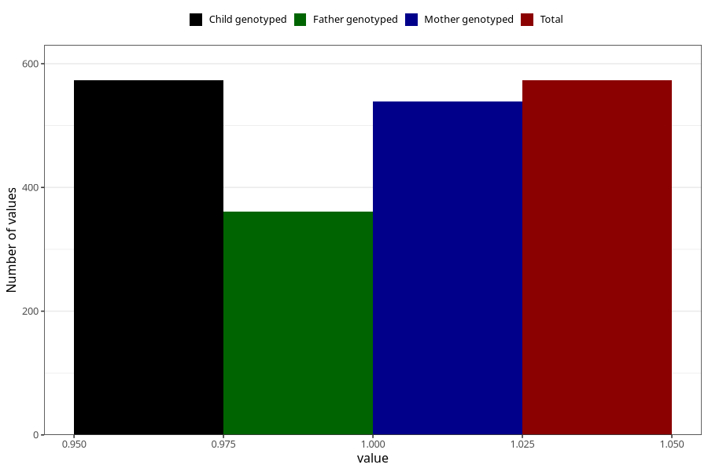

# formula_colett_2m
Variable mapping to `DD58` in `Skjema4_6mnd_v12`.
- Number of values:

| Value | Total | Child genotyped | Mother genotyped | Father genotyped |
| ----- | ----- | --------------- | ---------------- | ---------------- |
| Missing | 74735 | 74735 | 71111 | 49723 |
| Non-missing | 573 | 573 | 539 | 361 |
| 1 | 573 | 573 | 539 | 361 |

