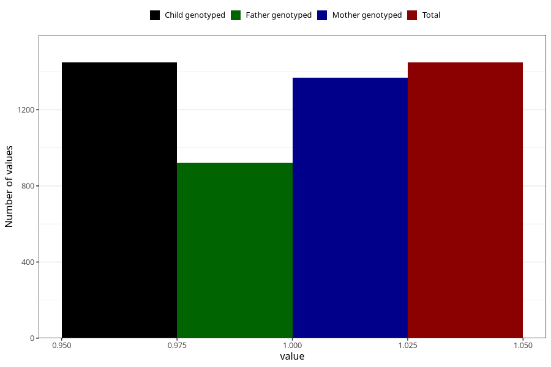

# formula_colett_omega3_1m
Variable mapping to `DD64` in `Skjema4_6mnd_v12`.
- Number of values:

| Value | Total | Child genotyped | Mother genotyped | Father genotyped |
| ----- | ----- | --------------- | ---------------- | ---------------- |
| Missing | 73860 | 73860 | 70282 | 49161 |
| Non-missing | 1448 | 1448 | 1368 | 923 |
| 1 | 1448 | 1448 | 1368 | 923 |

