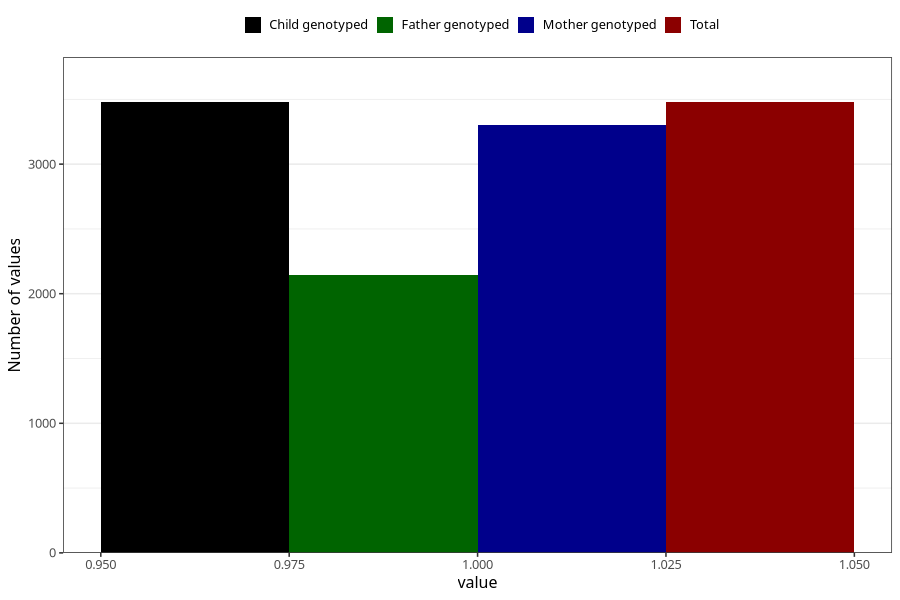

# formula_colett_omega3_5m
Variable mapping to `DD68` in `Skjema4_6mnd_v12`.
- Number of values:

| Value | Total | Child genotyped | Mother genotyped | Father genotyped |
| ----- | ----- | --------------- | ---------------- | ---------------- |
| Missing | 71830 | 71830 | 68349 | 47937 |
| Non-missing | 3478 | 3478 | 3301 | 2147 |
| 1 | 3478 | 3478 | 3301 | 2147 |

