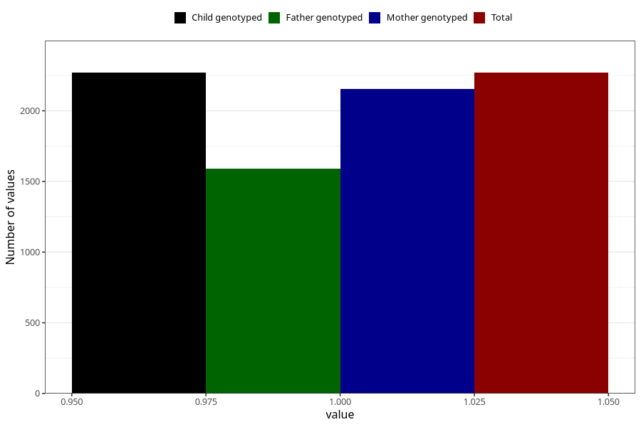

# formula_nan_ha1_0m
Variable mapping to `DD77` in `Skjema4_6mnd_v12`.
- Number of values:

| Value | Total | Child genotyped | Mother genotyped | Father genotyped |
| ----- | ----- | --------------- | ---------------- | ---------------- |
| Missing | 73039 | 73039 | 69498 | 48492 |
| Non-missing | 2269 | 2269 | 2152 | 1592 |
| 1 | 2269 | 2269 | 2152 | 1592 |

