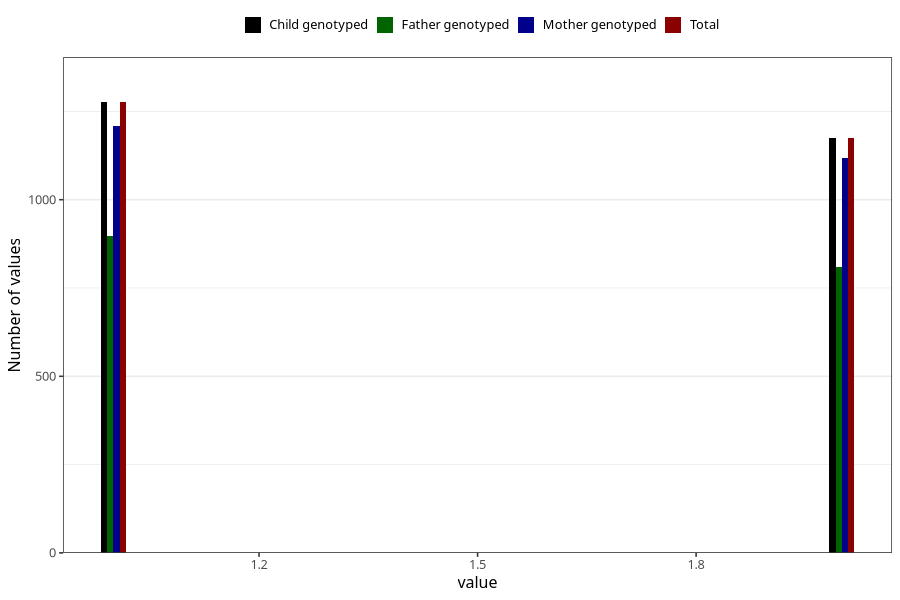

# omega3_capsules_amount_per_time_7y
Variable mapping to `JJ533` in `Skjema7aar_v12`.
Variable mapping to `JJ533` in `Skjema7aar_v12`.
- Number of values:

| Value | Total | Child genotyped | Mother genotyped | Father genotyped |
| ----- | ----- | --------------- | ---------------- | ---------------- |
| Missing | 72768 | 72768 | 69242 | 48319 |
| Non-missing | 2540 | 2540 | 2408 | 1765 |
| 3+ at a time | 89 | 89 | 82 |57 |
| More than 1 check box filled in | 1 | 1 | 1 |1 |
| 1 | 1276 | 1276 | 1208 | 897 |
| 2 | 1174 | 1174 | 1117 | 810 |

