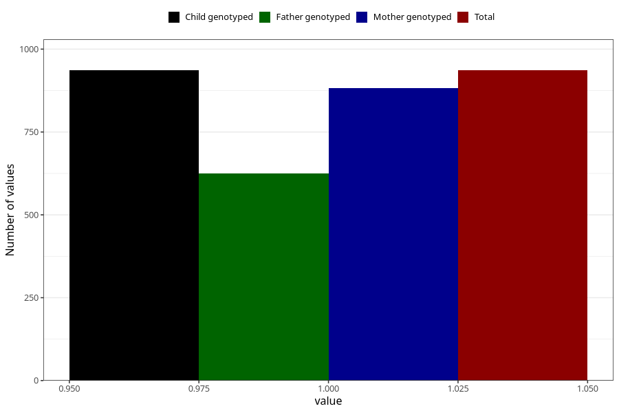

# other_milk_2m
Variable mapping to `DD86` in `Skjema4_6mnd_v12`.
- Number of values:

| Value | Total | Child genotyped | Mother genotyped | Father genotyped |
| ----- | ----- | --------------- | ---------------- | ---------------- |
| Missing | 74372 | 74372 | 70768 | 49460 |
| Non-missing | 936 | 936 | 882 | 624 |
| 1 | 936 | 936 | 882 | 624 |

