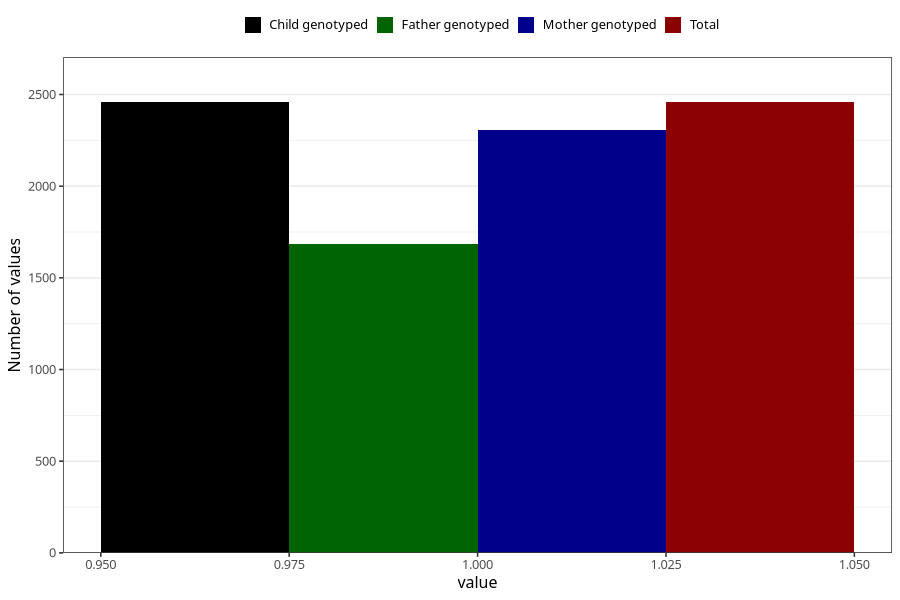

# other_milk_5m
Variable mapping to `DD89` in `Skjema4_6mnd_v12`.
- Number of values:

| Value | Total | Child genotyped | Mother genotyped | Father genotyped |
| ----- | ----- | --------------- | ---------------- | ---------------- |
| Missing | 72850 | 72850 | 69341 | 48402 |
| Non-missing | 2458 | 2458 | 2309 | 1682 |
| 1 | 2458 | 2458 | 2309 | 1682 |

