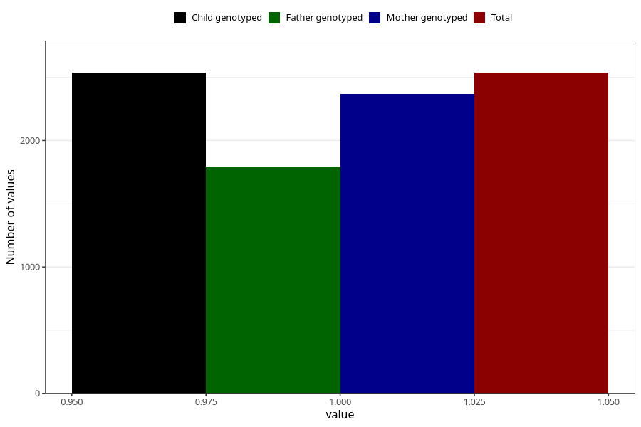

# other_milk_6m
Variable mapping to `DD90` in `Skjema4_6mnd_v12`.
- Number of values:

| Value | Total | Child genotyped | Mother genotyped | Father genotyped |
| ----- | ----- | --------------- | ---------------- | ---------------- |
| Missing | 72772 | 72772 | 69279 | 48288 |
| Non-missing | 2536 | 2536 | 2371 | 1796 |
| 1 | 2536 | 2536 | 2371 | 1796 |

