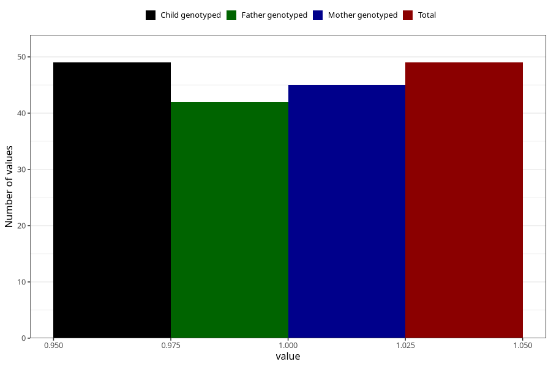

# father_eating_disorders
Variable mapping to `FF389` in `SkjemaFar_v12`.
- Number of values:

| Value | Total | Child genotyped | Mother genotyped | Father genotyped |
| ----- | ----- | --------------- | ---------------- | ---------------- |
| Missing | 75259 | 75259 | 71605 | 50042 |
| Non-missing | 49 | 49 | 45 | 42 |
| 1 | 49 | 49 | 45 | 42 |

