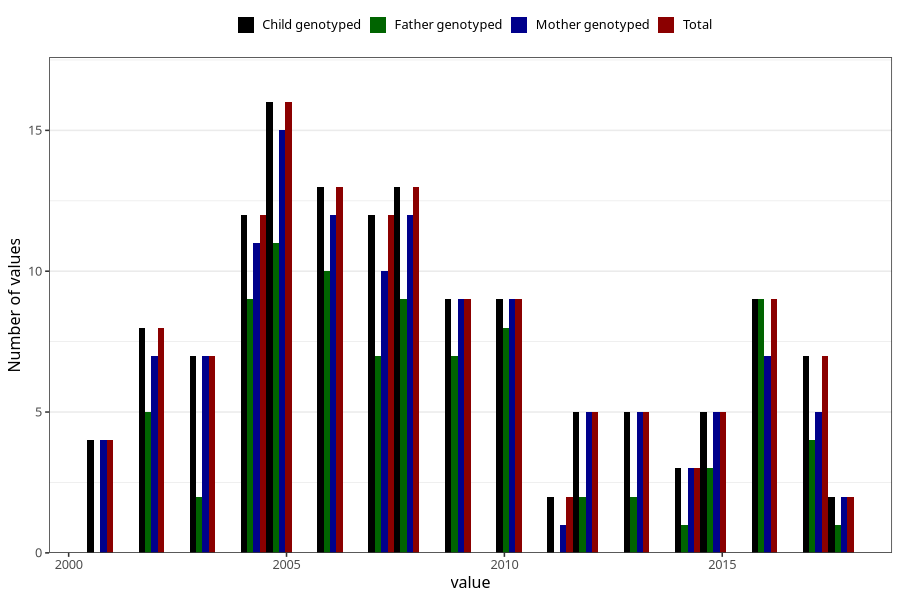

# death_year
Variable mapping to `DAAR` in `MFR_541_v12`.
Variable mapping to `DAAR` in `MFR_541_v12`.
- Number of values:

| Value | Total | Child genotyped | Mother genotyped | Father genotyped |
| ----- | ----- | --------------- | ---------------- | ---------------- |
| Missing | 75167 | 75167 | 71521 | 49994 |
| Non-missing | 141 | 141 | 129 | 90 |
| 2001 | 4 | 4 | 4 | 0 |
| 2002 | 8 | 8 | 7 | 5 |
| 2003 | 7 | 7 | 7 | 2 |
| 2004 | 12 | 12 | 11 | 9 |
| 2005 | 16 | 16 | 15 | 11 |
| 2006 | 13 | 13 | 12 | 10 |
| 2007 | 12 | 12 | 10 | 7 |
| 2008 | 13 | 13 | 12 | 9 |
| 2009 | 9 | 9 | 9 | 7 |
| 2010 | 9 | 9 | 9 | 8 |
| 2011 | 2 | 2 | 1 | 0 |
| 2012 | 5 | 5 | 5 | 2 |
| 2013 | 5 | 5 | 5 | 2 |
| 2014 | 3 | 3 | 3 | 1 |
| 2015 | 5 | 5 | 5 | 3 |
| 2016 | 9 | 9 | 7 | 9 |
| 2017 | 7 | 7 | 5 | 4 |
| 2018 | 2 | 2 | 2 | 1 |

