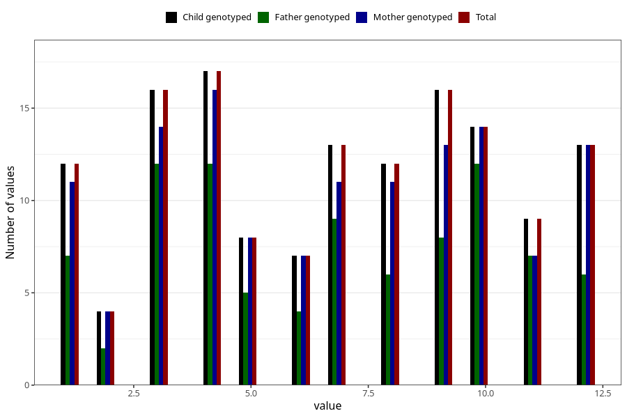

# month_death_child
Variable mapping to `DMND` in `MFR_541_v12`.
- Number of values:

| Value | Total | Child genotyped | Mother genotyped | Father genotyped |
| ----- | ----- | --------------- | ---------------- | ---------------- |
| Missing | 75167 | 75167 | 71521 | 49994 |
| Non-missing | 141 | 141 | 129 | 90 |
| 1 | 12 | 12 | 11 | 7 |
| 2 | 4 | 4 | 4 | 2 |
| 3 | 16 | 16 | 14 | 12 |
| 4 | 17 | 17 | 16 | 12 |
| 5 | 8 | 8 | 8 | 5 |
| 6 | 7 | 7 | 7 | 4 |
| 7 | 13 | 13 | 11 | 9 |
| 8 | 12 | 12 | 11 | 6 |
| 9 | 16 | 16 | 13 | 8 |
| 10 | 14 | 14 | 14 | 12 |
| 11 | 9 | 9 | 7 | 7 |
| 12 | 13 | 13 | 13 | 6 |

