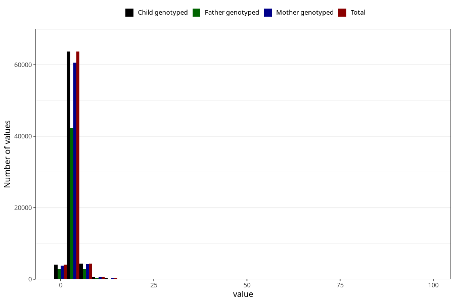

# mother_days_hospital_birth
Variable mapping to `LIGGEDOGN_MOR` in `MFR_541_v12`.
- Number of values:

| Value | Total | Child genotyped | Mother genotyped | Father genotyped |
| ----- | ----- | --------------- | ---------------- | ---------------- |
| Missing | 2263 | 2263 | 2111 | 1583 |
| Non-missing | 73045 | 73045 | 69539 | 48501 |
| 25th percentile | 3 | 3 | 3 | 2 |
| 50th percentile | 3 | 3 | 3 | 3 |
| 75th percentile | 4 | 4 | 4 | 4 |
| Mean | 3.43736053117941 | 3.43736053117941 | 3.44393793410892 | 3.38502298921672 |
| Standard deviation | 2.03375841928479 | 2.03375841928479 | 2.04317976848333 | 2.04319378404551 |
| N | 73045 | 73045 | 69539 | 48501 |

