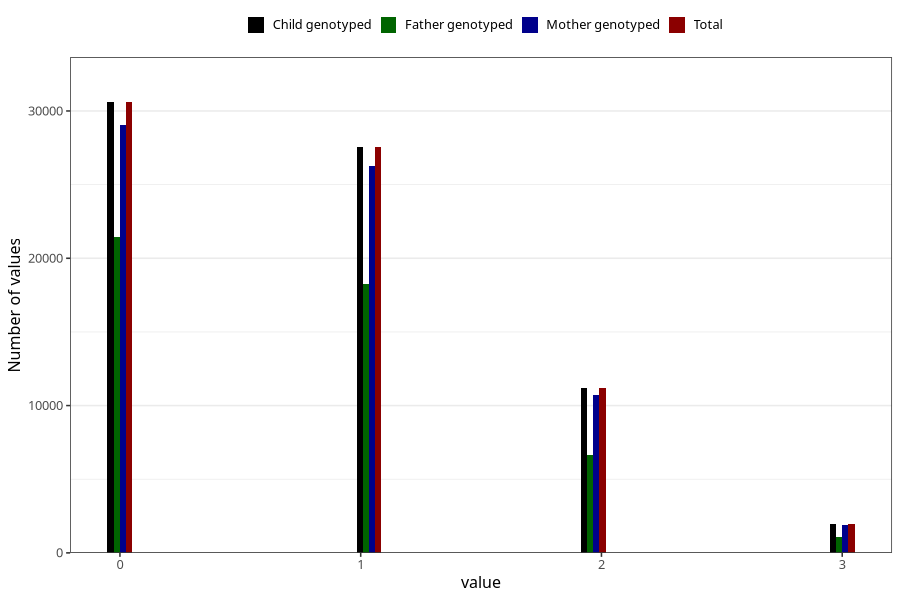

# n_previous_live_births
Variable mapping to `LEVENDEFODTE_5` in `MFR_541_v12`.
- Number of values:

| Value | Total | Child genotyped | Mother genotyped | Father genotyped |
| ----- | ----- | --------------- | ---------------- | ---------------- |
| Missing | 3483 | 3483 | 3316 | 2400 |
| Non-missing | 71825 | 71825 | 68334 | 47684 |
| 4 or more | 492 | 492 | 469 |222 |
| 0 | 30596 | 30596 | 29015 | 21477 |
| 1 | 27566 | 27566 | 26257 | 18240 |
| 2 | 11189 | 11189 | 10690 | 6671 |
| 3 | 1982 | 1982 | 1903 | 1074 |

