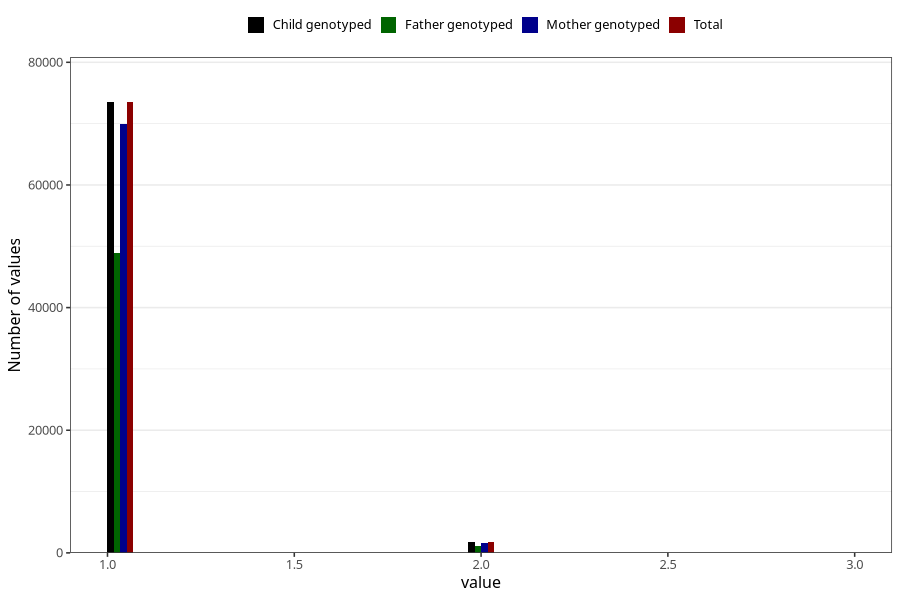

# plurality
Variable mapping to `PLURAL` in `MFR_541_v12`.
- Number of values:

| Value | Total | Child genotyped | Mother genotyped | Father genotyped |
| ----- | ----- | --------------- | ---------------- | ---------------- |
| Missing | 61 | 61 | 57 | 40 |
| Non-missing | 75247 | 75247 | 71593 | 50044 |
| 1 | 73495 | 73495 | 69905 | 48927 |
| 2 | 1735 | 1735 | 1671 | 1110 |
| 3 | 17 | 17 | 17 | 7 |

