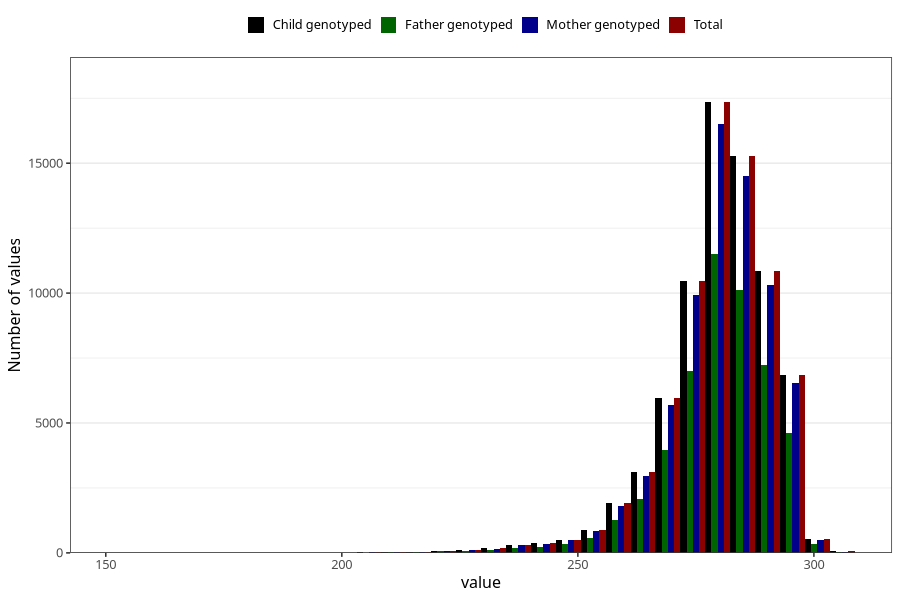

# pregnancy_duration
Variable mapping to `SVLEN_DG` in `MFR_541_v12`.
Variable mapping to `SVLEN_DG` in `MFR_541_v12`.
- Number of values:

| Value | Total | Child genotyped | Mother genotyped | Father genotyped |
| ----- | ----- | --------------- | ---------------- | ---------------- |
| Missing | 360 | 360 | 346 | 235 |
| Non-missing | 74948 | 74948 | 71304 | 49849 |
| 25th percentile | 274 | 274 | 274 | 274 |
| 50th percentile | 281 | 281 | 281 | 281 |
| 75th percentile | 287 | 287 | 287 | 287 |
| Mean | 279.683166995784 | 279.683166995784 | 279.676203298553 | 279.717426628418 |
| Standard deviation | 11.6583796059194 | 11.6583796059194 | 11.6681521594778 | 11.6578757874709 |
| N | 74948 | 74948 | 71304 | 49849 |

