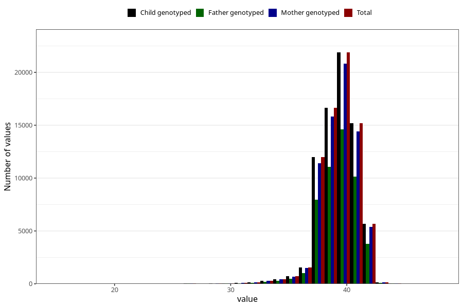

# pregnancy_duration_weeks
Variable mapping to `SVLEN` in `MFR_541_v12`.
- Number of values:

| Value | Total | Child genotyped | Mother genotyped | Father genotyped |
| ----- | ----- | --------------- | ---------------- | ---------------- |
| Missing | 333 | 333 | 320 | 216 |
| Non-missing | 74975 | 74975 | 71330 | 49868 |
| 25th percentile | 39 | 39 | 39 | 39 |
| 50th percentile | 40 | 40 | 40 | 40 |
| 75th percentile | 41 | 41 | 41 | 41 |
| Mean | 39.5301500500167 | 39.5301500500167 | 39.5290901443993 | 39.5358546562926 |
| Standard deviation | 1.70358466389873 | 1.70358466389873 | 1.70538210989015 | 1.70358966205789 |
| N | 74975 | 74975 | 71330 | 49868 |

