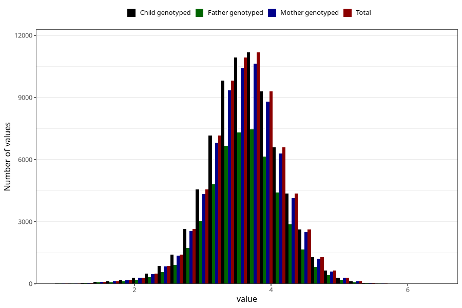

# weight_birth
Variable mapping to `VEKT` in `MFR_541_v12`.
Variable mapping to `VEKT` in `MFR_541_v12`.
- Number of values:

| Value | Total | Child genotyped | Mother genotyped | Father genotyped |
| ----- | ----- | --------------- | ---------------- | ---------------- |
| Missing | 119 | 119 | 113 | 78 |
| Non-missing | 75189 | 75189 | 71537 | 50006 |
| 25th percentile | 3.29 | 3.29 | 3.29 | 3.296 |
| 50th percentile | 3.63 | 3.63 | 3.63 | 3.62 |
| 75th percentile | 3.96 | 3.96 | 3.96 | 3.96 |
| Mean | 3.61632649722699 | 3.61632649722699 | 3.61594175042286 | 3.61415426148862 |
| Standard deviation | 0.541499381185398 | 0.541499381185398 | 0.541866174896335 | 0.537904508472009 |
| N | 75189 | 75189 | 71537 | 50006 |

