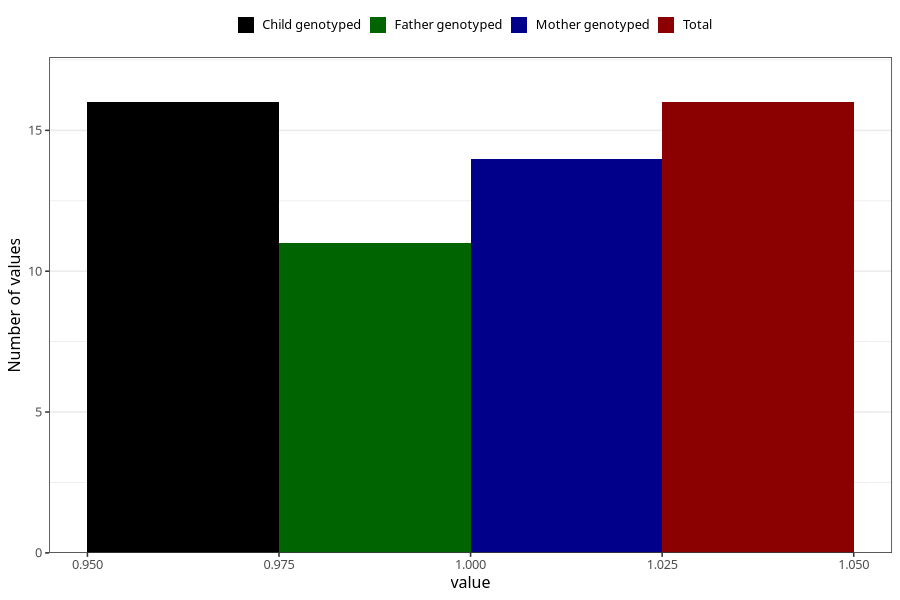

# cocaine_during
Variable mapping to `AA1447` in `Skjema1_v12`.
- Number of values:

| Value | Total | Child genotyped | Mother genotyped | Father genotyped |
| ----- | ----- | --------------- | ---------------- | ---------------- |
| Missing | 75292 | 75292 | 71636 | 50073 |
| Non-missing | 16 | 16 | 14 | 11 |
| 1 | 16 | 16 | 14 | 11 |

