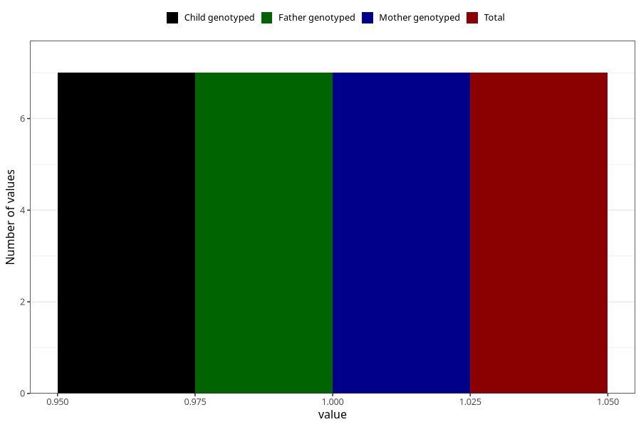

# ecstasy_during
Variable mapping to `AA1443` in `Skjema1_v12`.
- Number of values:

| Value | Total | Child genotyped | Mother genotyped | Father genotyped |
| ----- | ----- | --------------- | ---------------- | ---------------- |
| Missing | 75301 | 75301 | 71643 | 50077 |
| Non-missing | 7 | 7 | 7 | 7 |
| 1 | 7 | 7 | 7 | 7 |

