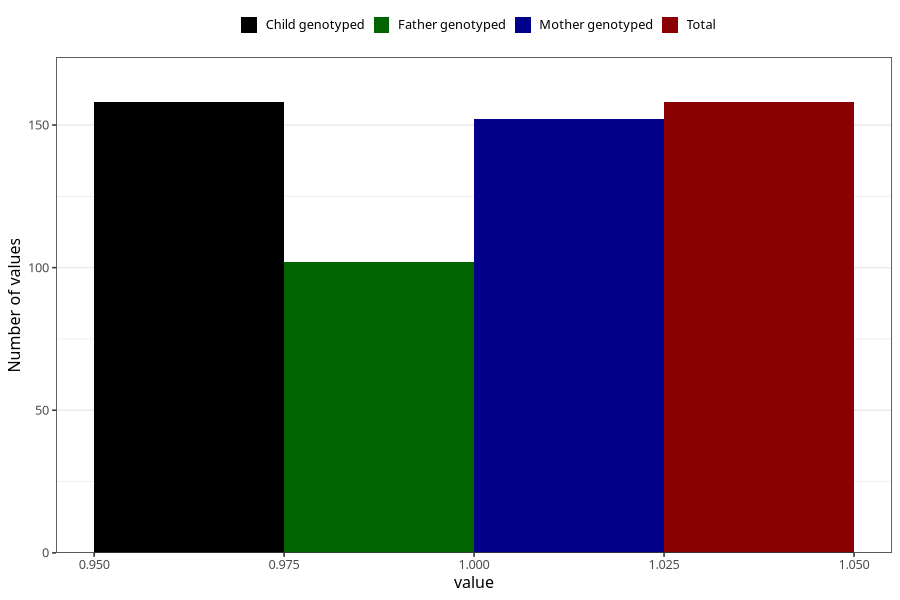

# endometriosis_during
Variable mapping to `AA690` in `Skjema1_v12`.
- Number of values:

| Value | Total | Child genotyped | Mother genotyped | Father genotyped |
| ----- | ----- | --------------- | ---------------- | ---------------- |
| Missing | 75150 | 75150 | 71498 | 49982 |
| Non-missing | 158 | 158 | 152 | 102 |
| 1 | 158 | 158 | 152 | 102 |

