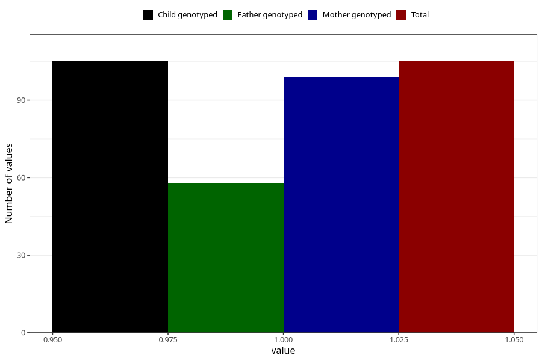

# hash_during
Variable mapping to `AA1435` in `Skjema1_v12`.
- Number of values:

| Value | Total | Child genotyped | Mother genotyped | Father genotyped |
| ----- | ----- | --------------- | ---------------- | ---------------- |
| Missing | 75203 | 75203 | 71551 | 50026 |
| Non-missing | 105 | 105 | 99 | 58 |
| 1 | 105 | 105 | 99 | 58 |

