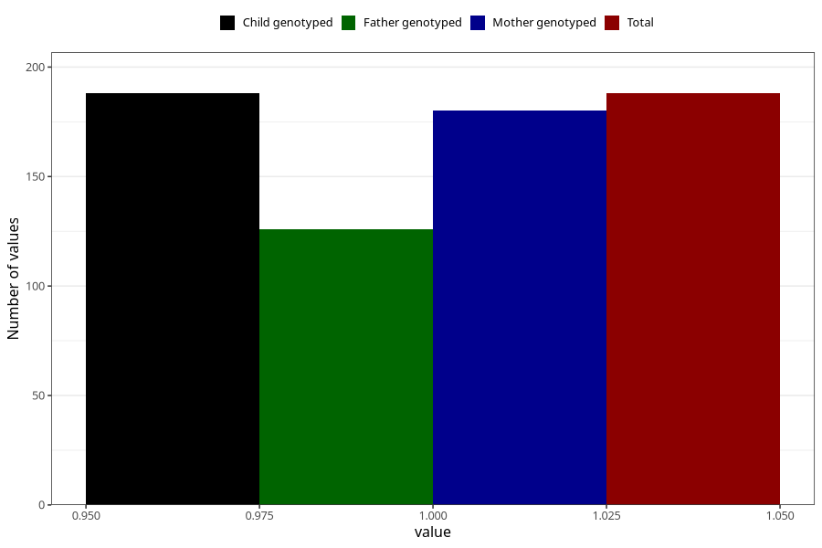

# high_cholesterol_during
Variable mapping to `AA546` in `Skjema1_v12`.
- Number of values:

| Value | Total | Child genotyped | Mother genotyped | Father genotyped |
| ----- | ----- | --------------- | ---------------- | ---------------- |
| Missing | 75120 | 75120 | 71470 | 49958 |
| Non-missing | 188 | 188 | 180 | 126 |
| 1 | 188 | 188 | 180 | 126 |

