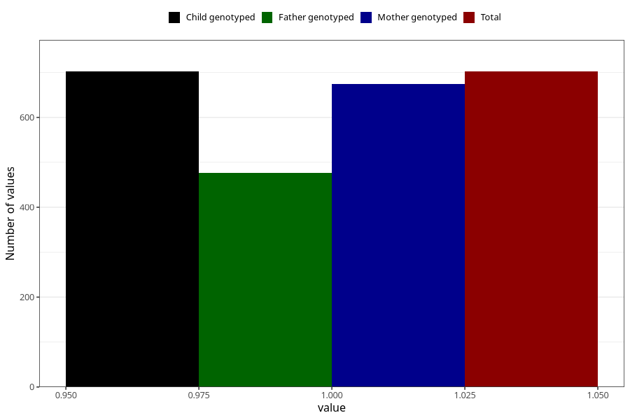

# highest_blood_pressure_before_pregnancy
Variable mapping to `AA554` in `Skjema1_v12`.
- Number of values:

| Value | Total | Child genotyped | Mother genotyped | Father genotyped |
| ----- | ----- | --------------- | ---------------- | ---------------- |
| Missing | 74606 | 74606 | 70976 | 49607 |
| Non-missing | 702 | 702 | 674 | 477 |
| 1 | 702 | 702 | 674 | 477 |

