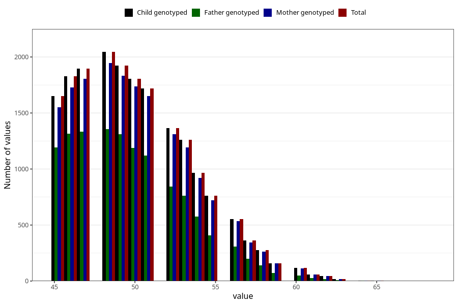

# age_answering_q_45m
Variable mapping to `AGE_YRS_LM` in `MobaForeldre45_Mor_v12_standard`.
- Number of values:

| Value | Total | Child genotyped | Mother genotyped | Father genotyped |
| ----- | ----- | --------------- | ---------------- | ---------------- |
| Missing | 56486 | 56486 | 53705 | 37854 |
| Non-missing | 18822 | 18822 | 17945 | 12230 |
| 25th percentile | 47 | 47 | 47 | 47 |
| 50th percentile | 50 | 50 | 50 | 49 |
| 75th percentile | 52 | 52 | 52 | 52 |
| Mean | 50.0475507384975 | 50.0475507384975 | 50.0657007522987 | 49.6979558462796 |
| Standard deviation | 3.64609429632815 | 3.64609429632815 | 3.64682740672987 | 3.47367527195858 |
| N | 18822 | 18822 | 17945 | 12230 |

