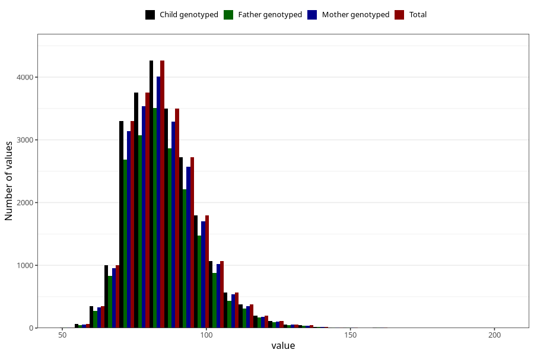

# father_weight_self_15w
Variable mapping to `FF334` in `SkjemaFar_v12`.
- Number of values:

| Value | Total | Child genotyped | Mother genotyped | Father genotyped |
| ----- | ----- | --------------- | ---------------- | ---------------- |
| Missing | 52085 | 52085 | 49724 | 31117 |
| Non-missing | 23223 | 23223 | 21926 | 18967 |
| 25th percentile | 77 | 77 | 77 | 77 |
| 50th percentile | 85 | 85 | 85 | 85 |
| 75th percentile | 93 | 93 | 93 | 93 |
| Mean | 85.9353442707661 | 85.9353442707661 | 85.9092994618261 | 85.9252385722571 |
| Standard deviation | 12.5276103119644 | 12.5276103119644 | 12.4789229168574 | 12.4494414595611 |
| N | 23223 | 23223 | 21926 | 18967 |

