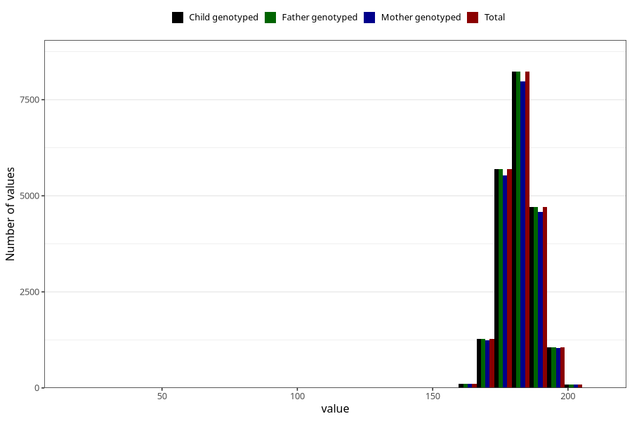

# height_father15
Variable mapping to `G__5` in `Far2_V12`.
- Number of values:

| Value | Total | Child genotyped | Mother genotyped | Father genotyped |
| ----- | ----- | --------------- | ---------------- | ---------------- |
| Missing | 54134 | 54134 | 51098 | 28910 |
| Non-missing | 21174 | 21174 | 20552 | 21174 |
| 25th percentile | 178 | 178 | 178 | 178 |
| 50th percentile | 182 | 182 | 182 | 182 |
| 75th percentile | 186 | 186 | 186 | 186 |
| Mean | 181.902049683574 | 181.902049683574 | 181.91562864928 | 181.902049683574 |
| Standard deviation | 6.79949757633557 | 6.79949757633557 | 6.81393759253455 | 6.79949757633557 |
| N | 21174 | 21174 | 20552 | 21174 |

