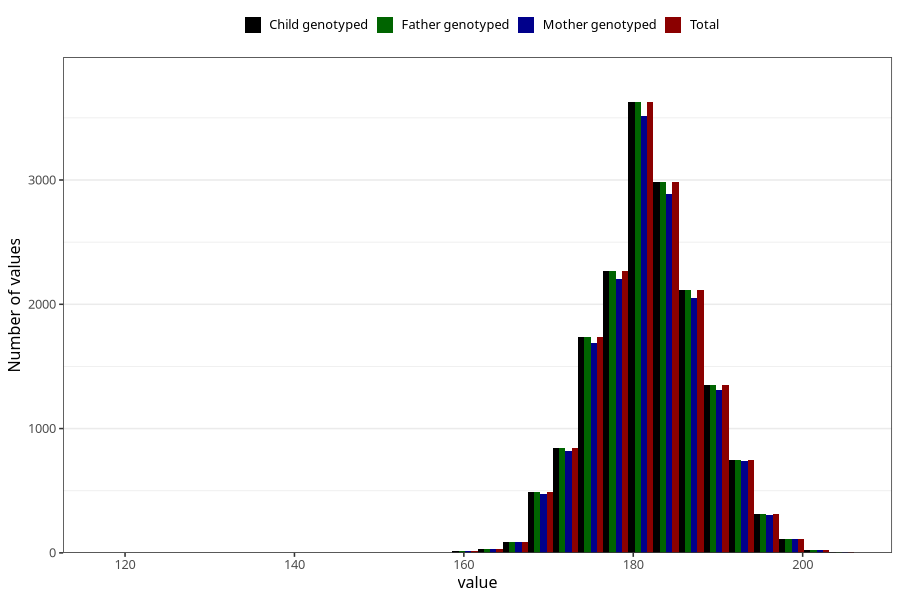

# height_hf
Variable mapping to `HF127` in `HelseFedre`.
- Number of values:

| Value | Total | Child genotyped | Mother genotyped | Father genotyped |
| ----- | ----- | --------------- | ---------------- | ---------------- |
| Missing | 58559 | 58559 | 55393 | 33335 |
| Non-missing | 16749 | 16749 | 16257 | 16749 |
| 25th percentile | 178 | 178 | 178 | 178 |
| 50th percentile | 182 | 182 | 182 | 182 |
| 75th percentile | 186 | 186 | 186 | 186 |
| Mean | 181.959221446056 | 181.959221446056 | 181.972135080273 | 181.959221446056 |
| Standard deviation | 6.33344768700207 | 6.33344768700207 | 6.34754769859085 | 6.33344768700207 |
| N | 16749 | 16749 | 16257 | 16749 |

