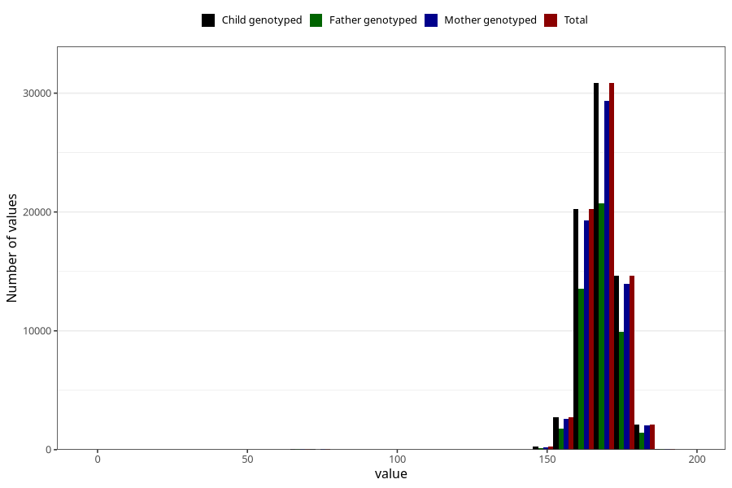

# mother_height
Variable mapping to `MORS_HOYDE` in `MFR_541_v12`.
Variable mapping to `MORS_HOYDE` in `MFR_541_v12`.
- Number of values:

| Value | Total | Child genotyped | Mother genotyped | Father genotyped |
| ----- | ----- | --------------- | ---------------- | ---------------- |
| Missing | 4271 | 4271 | 4050 | 2417 |
| Non-missing | 71037 | 71037 | 67600 | 47667 |
| 25th percentile | 164 | 164 | 164 | 164 |
| 50th percentile | 168 | 168 | 168 | 168 |
| 75th percentile | 172 | 172 | 172 | 172 |
| Mean | 168.154834804398 | 168.154834804398 | 168.155014792899 | 168.224851574465 |
| Standard deviation | 7.49444110674597 | 7.49444110674597 | 7.4717123605423 | 7.26220390833216 |
| N | 71037 | 71037 | 67600 | 47667 |

