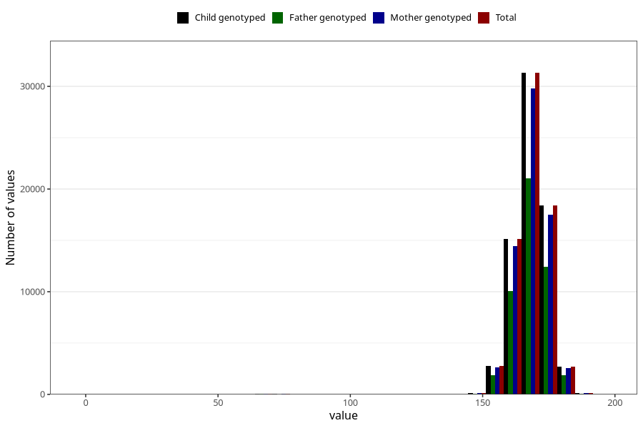

# mother_height_self
Variable mapping to `AA87` in `Skjema1_v12`.
- Number of values:

| Value | Total | Child genotyped | Mother genotyped | Father genotyped |
| ----- | ----- | --------------- | ---------------- | ---------------- |
| Missing | 4611 | 4611 | 4375 | 2656 |
| Non-missing | 70697 | 70697 | 67275 | 47428 |
| 25th percentile | 164 | 164 | 164 | 164 |
| 50th percentile | 168 | 168 | 168 | 168 |
| 75th percentile | 172 | 172 | 172 | 172 |
| Mean | 168.161223248511 | 168.161223248511 | 168.158513563731 | 168.226849118664 |
| Standard deviation | 7.46601289541909 | 7.46601289541909 | 7.46938495975193 | 7.28749351515658 |
| N | 70697 | 70697 | 67275 | 47428 |

