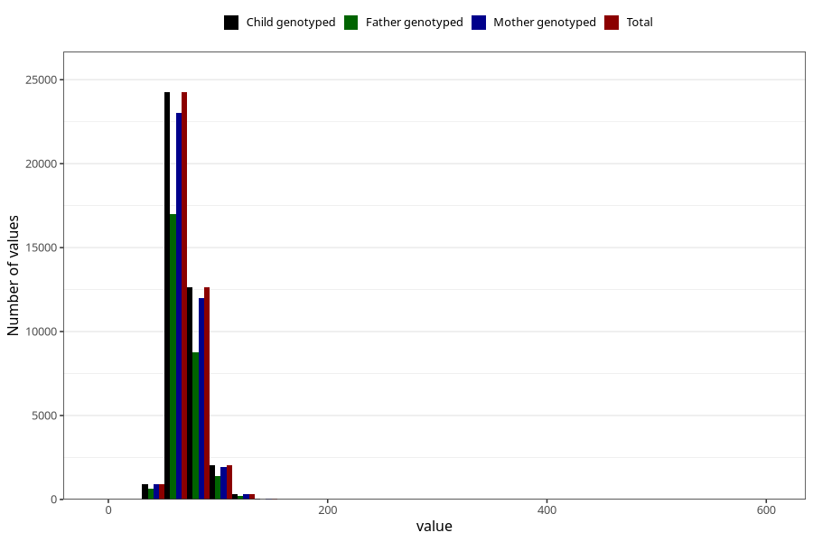

# mother_weight_3y
Variable mapping to `GG501` in `Skjema6_3aar_v12`.
- Number of values:

| Value | Total | Child genotyped | Mother genotyped | Father genotyped |
| ----- | ----- | --------------- | ---------------- | ---------------- |
| Missing | 35093 | 35093 | 33450 | 22062 |
| Non-missing | 40215 | 40215 | 38200 | 28022 |
| 25th percentile | 61 | 61 | 61 | 61 |
| 50th percentile | 68 | 68 | 68 | 68 |
| 75th percentile | 76.2 | 76.2 | 76 | 76 |
| Mean | 70.0791023250031 | 70.0791023250031 | 70.0465052356021 | 69.9676182999072 |
| Standard deviation | 13.1775007880967 | 13.1775007880967 | 13.1684087702454 | 13.1868826943756 |
| N | 40215 | 40215 | 38200 | 28022 |

